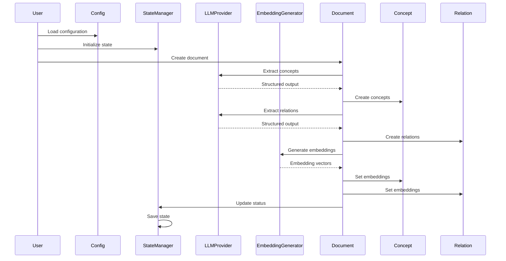

# Architecture Documentation

This directory contains comprehensive architecture documentation for the Knowledge Compiler Phase 1 implementation.

## Overview

The Knowledge Compiler is a system for processing documents, extracting knowledge, and building a knowledge graph. Phase 1 implements the core data models, configuration system, LLM integration, embedding generation, and state management.

## Documentation Files

### [Data Models](data-models.md)
Comprehensive documentation of all data models including:
- BaseModel and common functionality
- Enums (SourceType, ProcessingStatus, ConceptType, RelationType)
- EnhancedDocument for document representation
- EnhancedConcept for concept extraction
- Relation for knowledge graph relationships
- TemporalInfo for time-aware knowledge
- Model relationships and usage examples

### [Configuration System](configuration.md)
Complete guide to the configuration system including:
- LLMConfig for LLM provider settings
- StorageConfig for file system configuration
- ProcessingConfig for processing behavior
- QualityConfig for quality thresholds
- LoggingConfig for logging settings
- YAML configuration files
- Environment variable overrides
- Usage examples and best practices

### [LLM Provider Integration](llm-integration.md)
Detailed documentation of LLM provider integration:
- LLMProvider abstract base class
- AnthropicProvider for Claude API
- OpenAIProvider for GPT API
- Rate limiting with token bucket algorithm
- Retry logic with exponential backoff
- Structured output generation
- Factory pattern for provider creation
- Usage examples and error handling

### [Embedding Generation](embeddings.md)
Complete guide to embedding generation:
- EmbeddingGenerator for OpenAI embeddings
- EmbeddingCache with LRU eviction
- Batch processing
- Caching strategy
- Integration with data models
- Performance optimization
- Best practices and troubleshooting

### [State Management](state-management.md)
Comprehensive state management documentation:
- StateManager for tracking processing status
- Thread-safe operations
- State persistence to disk
- Incremental processing support
- Query operations
- Integration examples
- Best practices and performance considerations

## System Architecture

### Component Diagram

```mermaid
graph TB
    subgraph "Core Models"
        BM[BaseModel]
        ED[EnhancedDocument]
        EC[EnhancedConcept]
        REL[Relation]
        TI[TemporalInfo]
    end

    subgraph "Configuration"
        CFG[Config]
        LLMC[LLMConfig]
        SC[StorageConfig]
        PC[ProcessingConfig]
        QC[QualityConfig]
        LC[LoggingConfig]
    end

    subgraph "Integrations"
        LLP[LLMProvider]
        AP[AnthropicProvider]
        OP[OpenAIProvider]
        RL[RateLimiter]
    end

    subgraph "ML"
        EG[EmbeddingGenerator]
        EC[EmbeddingCache]
    end

    subgraph "State"
        SM[StateManager]
    end

    CFG --> LLMC
    CFG --> SC
    CFG --> PC
    CFG --> QC
    CFG --> LC

    LLP <|-- AP
    LLP <|-- OP
    LLP *-- RL

    EG *-- EC

    ED --> BM
    EC --> BM
    REL --> BM
    TI --> BM
```

### Data Flow



## Key Design Principles

### 1. Modularity
- Each component has a single, well-defined responsibility
- Clear interfaces between components
- Easy to test and maintain

### 2. Type Safety
- Pydantic models for validation
- Type hints throughout
- Compile-time and runtime type checking

### 3. Extensibility
- Abstract base classes for providers
- Configurable components
- Plugin architecture for future expansion

### 4. Performance
- Caching to avoid redundant operations
- Batch processing for efficiency
- Async-friendly design

### 5. Reliability
- Automatic retry with exponential backoff
- State persistence for recovery
- Thread-safe operations

## Technology Stack

### Core Dependencies
- **Python 3.13+**: Modern Python with type hints
- **Pydantic**: Data validation and settings management
- **Pydantic Settings**: Configuration with environment variables
- **NumPy**: Numerical operations and embeddings

### Optional Dependencies
- **anthropic**: Anthropic Claude API client
- **openai**: OpenAI GPT API client
- **PyYAML**: YAML configuration file support
- **jsonschema**: JSON schema validation

## Quick Start

### Installation

```bash
# Install core dependencies
pip install pydantic pydantic-settings numpy

# Install LLM providers (optional)
pip install anthropic openai

# Install additional dependencies
pip install pyyaml jsonschema
```

### Basic Usage

```python
from src.core.config import get_config
from src.core.state_manager import StateManager
from src.integrations.llm_providers import get_llm_provider
from src.ml.embeddings import EmbeddingGenerator

# Load configuration
config = get_config()

# Initialize components
state_manager = StateManager()
llm_provider = get_llm_provider(
    provider=config.llm.provider,
    model=config.llm.model
)
embedding_generator = EmbeddingGenerator()

# Process a document
from src.core.document_model import EnhancedDocument, DocumentMetadata
from src.core.base_models import SourceType

doc = EnhancedDocument(
    id="doc-001",
    source_type=SourceType.MARKDOWN,
    content="Machine learning is a subset of AI...",
    metadata=DocumentMetadata(title="Introduction to ML")
)

# Generate embedding
doc.embeddings = embedding_generator.generate_embedding(doc.content)

# Extract concepts
schema = {
    "type": "object",
    "properties": {
        "concepts": {
            "type": "array",
            "items": {
                "type": "object",
                "properties": {
                    "name": {"type": "string"},
                    "definition": {"type": "string"}
                }
            }
        }
    }
}

result = llm_provider.generate_structured(
    f"Extract concepts from: {doc.content}",
    schema=schema
)

# Update state
state_manager.update_document_status("doc-001", "processed")
state_manager.save()
```

## Project Structure

```
src/
├── core/
│   ├── __init__.py
│   ├── base_models.py       # BaseModel and enums
│   ├── document_model.py    # EnhancedDocument
│   ├── concept_model.py     # EnhancedConcept, TemporalInfo
│   ├── relation_model.py    # Relation
│   ├── config.py            # Configuration system
│   └── state_manager.py     # State persistence
├── integrations/
│   ├── __init__.py
│   └── llm_providers.py     # LLM provider integration
├── ml/
│   ├── __init__.py
│   └── embeddings.py        # Embedding generation
└── models/
    ├── __init__.py
    ├── document.py          # Legacy document models
    └── concept.py           # Legacy concept models
```

## Development Workflow

### Adding New Features

1. **Define data models** in `src/core/`
2. **Add configuration** in `src/core/config.py`
3. **Implement logic** in appropriate module
4. **Write tests** in `tests/`
5. **Update documentation** in `docs/architecture/`

### Testing

```bash
# Run all tests
pytest

# Run specific test file
pytest tests/test_state_manager.py

# Run with coverage
pytest --cov=src --cov-report=html
```

### Configuration

Create a `config.yaml` file:

```yaml
knowledge_compiler:
  llm:
    provider: anthropic
    model: claude-sonnet-4-6
    temperature: 0.3

  storage:
    raw_dir: ./raw
    wiki_dir: ./wiki
    cache_dir: ./cache

  processing:
    batch_size: 10
    parallel_workers: 4
    cache_embeddings: true

  quality:
    min_document_quality: 0.6
    min_concept_confidence: 0.7

  logging:
    level: INFO
    format: structured
```

Set environment variables:

```bash
export ANTHROPIC_API_KEY=your_key_here
export OPENAI_API_KEY=your_key_here
```

## Performance Considerations

### Optimization Strategies

1. **Enable caching**: Configure cache sizes appropriately
2. **Batch processing**: Process multiple items together
3. **Rate limiting**: Configure rate limits to match API quotas
4. **Incremental processing**: Use state manager to skip completed work
5. **Parallel processing**: Use multiple workers for CPU-bound tasks

### Monitoring

Monitor these metrics:

- Cache hit rates
- API call counts
- Processing times
- Error rates
- State persistence times

## Best Practices

### Code Organization

1. Use type hints for all functions
2. Write docstrings for all public methods
3. Keep functions focused and small
4. Use composition over inheritance
5. Follow PEP 8 style guidelines

### Error Handling

1. Always handle API errors gracefully
2. Use retry logic for transient failures
3. Log errors with context
4. Validate inputs early
5. Provide meaningful error messages

### Configuration

1. Use environment variables for secrets
2. Provide sensible defaults
3. Validate configuration on startup
4. Document configuration options
5. Support multiple environments

## Future Enhancements

Planned features for Phase 2:

1. **Database backend**: Replace JSON state with SQLite/PostgreSQL
2. **Async processing**: Support for async/await
3. **Vector database**: Integration with vector stores
4. **Advanced caching**: Redis-based distributed caching
5. **Metrics**: OpenTelemetry integration
6. **API server**: REST API for programmatic access

## Contributing

When contributing to the architecture:

1. Update relevant documentation
2. Add examples for new features
3. Maintain backward compatibility
4. Add tests for new functionality
5. Update this README if needed

## Resources

### External Documentation

- [Pydantic Documentation](https://docs.pydantic.dev/)
- [Anthropic Claude API](https://docs.anthropic.com/)
- [OpenAI API Documentation](https://platform.openai.com/docs/)
- [NumPy Documentation](https://numpy.org/doc/)

### Internal Documentation

- [Main README](../../README.md)
- [Usage Guide](../USAGE.md)
- [API Documentation](../api/)

## Support

For questions or issues:

1. Check existing documentation
2. Review example code
3. Check test files for usage patterns
4. Open an issue on GitHub

## License

This project is licensed under the MIT License.
