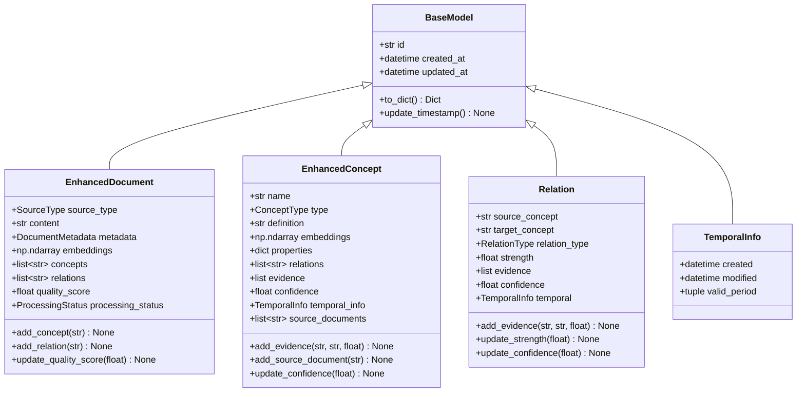
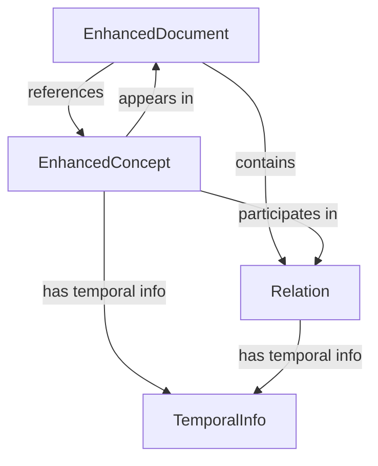

# Core Data Models

This document describes the core data models that form the foundation of the Knowledge Compiler system.

## Overview

The Knowledge Compiler uses a hierarchical model architecture where all models inherit from a common `BaseModel` class. This provides consistent functionality across all entities including automatic timestamping, serialization, and ID management.



## BaseModel

The `BaseModel` is the foundation for all entities in the system. It provides common fields and functionality.

### Fields

- **id** (`str`): Unique identifier for the entity
- **created_at** (`datetime`): Timestamp when the entity was created
- **updated_at** (`datetime`): Timestamp when the entity was last modified

### Methods

#### `to_dict() -> Dict[str, Any]`
Convert the model to a dictionary representation.

**Returns:** Dictionary containing all model fields

**Example:**
```python
from src.core.base_models import BaseModel

model = BaseModel(id="doc-001")
data = model.to_dict()
# {'id': 'doc-001', 'created_at': '2026-04-05T10:30:00', 'updated_at': '2026-04-05T10:30:00'}
```

#### `update_timestamp() -> None`
Update the `updated_at` timestamp to the current time.

**Example:**
```python
model.update_timestamp()
```

## Enums

### SourceType

Defines the types of sources for documents.

**Values:**
- `WEB_CLIPPER`: Content from web clipping tools
- `PDF`: PDF documents
- `MARKDOWN`: Markdown files
- `TEXT`: Plain text files
- `IMAGE`: Image files

**Example:**
```python
from src.core.base_models import SourceType

source = SourceType.MARKDOWN
print(source.value)  # 'markdown'
```

### ProcessingStatus

Tracks the processing status of documents.

**Values:**
- `PENDING`: Document is waiting to be processed
- `PROCESSING`: Document is currently being processed
- `PROCESSED`: Document has been successfully processed
- `FAILED`: Document processing failed
- `SKIPPED`: Document was skipped (e.g., duplicate, low quality)

**Example:**
```python
from src.core.base_models import ProcessingStatus

status = ProcessingStatus.PROCESSED
```

### ConceptType

Defines the types of concepts in the knowledge graph.

**Values:**
- `TERM`: Terminology or definitions
- `INDICATOR`: Metrics or indicators
- `STRATEGY`: Strategies or methodologies
- `THEORY`: Theoretical frameworks
- `PERSON`: People or authors

**Example:**
```python
from src.core.concept_model import ConceptType

concept_type = ConceptType.STRATEGY
```

### RelationType

Defines the types of relationships between concepts.

**Values:**
- `RELATED_TO`: General relationship
- `CAUSES`: Causal relationship
- `CAUSED_BY`: Reverse causal relationship
- `CONTAINS`: Hierarchical containment
- `CONTAINED_IN`: Reverse hierarchical containment
- `SIMILAR_TO`: Similarity relationship
- `OPPOSES`: Opposition relationship
- `SUPPORTS`: Supportive relationship
- `PRECEDES`: Temporal precedence
- `FOLLOWS`: Temporal succession
- `DEPENDS_ON`: Dependency relationship
- `ENABLES`: Enablement relationship

**Example:**
```python
from src.core.relation_model import RelationType

relation_type = RelationType.CAUSES
```

## EnhancedDocument

Represents a document with content, metadata, embeddings, and relationships.

### Fields

- **source_type** (`SourceType`): Type of document source
- **content** (`str`): Original document content
- **metadata** (`DocumentMetadata`): Document metadata (title, author, tags, etc.)
- **embeddings** (`np.ndarray`, optional): Content embedding vector
- **concepts** (`List[str]`): List of concept IDs referenced in document
- **relations** (`List[str]`): List of relation IDs for document relationships
- **quality_score** (`float`): Quality score from 0.0 to 1.0
- **processing_status** (`ProcessingStatus`): Current processing status

### DocumentMetadata

Sub-model containing document metadata:

- **title** (`str`, optional): Document title
- **author** (`str`, optional): Document author or creator
- **date** (`datetime`, optional): Document creation or publication date
- **tags** (`List[str]`): Tags or categories for the document
- **source_url** (`str`, optional): URL if document is from web
- **file_path** (`str`, optional): Local file path if document is from file

### Methods

#### `add_concept(concept_id: str) -> None`
Add a concept ID to the document's concept list.

**Parameters:**
- `concept_id`: The concept ID to add

**Behavior:**
- Duplicate concept IDs are ignored
- Modifies the document in place
- Updates the timestamp

**Example:**
```python
from src.core.document_model import EnhancedDocument, DocumentMetadata
from src.core.base_models import SourceType

metadata = DocumentMetadata(title="Sample Document")
doc = EnhancedDocument(
    id="doc-001",
    source_type=SourceType.MARKDOWN,
    content="# Sample\n\nThis is sample content.",
    metadata=metadata
)

doc.add_concept("concept-001")
doc.add_concept("concept-002")
print(doc.concepts)  # ['concept-001', 'concept-002']
```

#### `add_relation(relation_id: str) -> None`
Add a relation ID to the document's relation list.

**Parameters:**
- `relation_id`: The relation ID to add

**Behavior:**
- Duplicate relation IDs are ignored
- Modifies the document in place
- Updates the timestamp

**Example:**
```python
doc.add_relation("rel-001")
print(doc.relations)  # ['rel-001']
```

#### `update_quality_score(score: float) -> None`
Update the quality score with validation.

**Parameters:**
- `score`: New quality score (must be between 0.0 and 1.0)

**Raises:**
- `ValueError`: If score is not between 0.0 and 1.0

**Example:**
```python
doc.update_quality_score(0.85)
print(doc.quality_score)  # 0.85

# This will raise ValueError
doc.update_quality_score(1.5)  # ValueError: quality_score must be between 0.0 and 1.0
```

#### `to_dict() -> Dict[str, Any]`
Convert document to dictionary with numpy arrays converted to lists.

**Returns:** Dictionary representation of the document

**Example:**
```python
doc_dict = doc.to_dict()
# Contains all fields with embeddings converted to list if present
```

## EnhancedConcept

Represents a concept with embeddings, evidence, and temporal information.

### Fields

- **name** (`str`): Concept name
- **type** (`ConceptType`): Concept type
- **definition** (`str`): Concept definition
- **embeddings** (`np.ndarray`, optional): Concept embedding vector
- **properties** (`Dict[str, Any]`): Dynamic properties for extensible metadata
- **relations** (`List[str]`): List of relation IDs
- **evidence** (`List[Dict[str, Any]]`): Supporting evidence
- **confidence** (`float`): Confidence score from 0.0 to 1.0
- **temporal_info** (`TemporalInfo`, optional): Temporal information
- **source_documents** (`List[str]`): Document IDs where concept appears

### Methods

#### `add_evidence(source: str, quote: str, confidence: float) -> None`
Add supporting evidence for this concept.

**Parameters:**
- `source`: Source document ID or reference
- `quote`: Text quote supporting the concept
- `confidence`: Confidence level of this evidence (0.0 to 1.0)

**Behavior:**
- Creates an evidence entry with source, quote, and confidence
- Adds to evidence list
- Updates timestamp

**Example:**
```python
from src.core.concept_model import EnhancedConcept, ConceptType

concept = EnhancedConcept(
    id="concept-001",
    name="Machine Learning",
    type=ConceptType.THEORY,
    definition="A subset of AI that enables systems to learn from data."
)

concept.add_evidence(
    source="doc-001",
    quote="Machine learning algorithms build models based on sample data.",
    confidence=0.9
)
```

#### `add_source_document(document_id: str) -> None`
Add a source document ID where this concept appears.

**Parameters:**
- `document_id`: ID of the document where the concept appears

**Behavior:**
- Duplicate document IDs are ignored
- Modifies the concept in place
- Updates timestamp

**Example:**
```python
concept.add_source_document("doc-001")
concept.add_source_document("doc-002")
print(concept.source_documents)  # ['doc-001', 'doc-002']
```

#### `update_confidence(confidence: float) -> None`
Update the confidence score with validation.

**Parameters:**
- `confidence`: New confidence score (0.0 to 1.0)

**Raises:**
- `ValueError`: If confidence is not between 0.0 and 1.0

**Example:**
```python
concept.update_confidence(0.95)
print(concept.confidence)  # 0.95
```

## Relation

Represents a relationship between two concepts in the knowledge graph.

### Fields

- **source_concept** (`str`): Source concept ID
- **target_concept** (`str`): Target concept ID
- **relation_type** (`RelationType`): Type of relationship
- **strength** (`float`): Relationship strength from 0.0 to 1.0
- **evidence** (`List[Dict[str, Any]]`): Supporting evidence
- **confidence** (`float`): Confidence score from 0.0 to 1.0
- **temporal** (`TemporalInfo`, optional): Temporal information

### Methods

#### `add_evidence(source: str, quote: str, confidence: float) -> None`
Add supporting evidence for this relation.

**Parameters:**
- `source`: Source document ID or reference
- `quote`: Text quote supporting the relation
- `confidence`: Confidence level of this evidence (0.0 to 1.0)

**Raises:**
- `ValueError`: If confidence is not between 0.0 and 1.0

**Example:**
```python
from src.core.relation_model import Relation, RelationType

relation = Relation(
    id="rel-001",
    source_concept="concept-001",
    target_concept="concept-002",
    relation_type=RelationType.CAUSES
)

relation.add_evidence(
    source="doc-001",
    quote="Factor A causes Factor B to increase",
    confidence=0.8
)
```

#### `update_strength(strength: float) -> None`
Update the strength score with validation.

**Parameters:**
- `strength`: New strength score (0.0 to 1.0)

**Raises:**
- `ValueError`: If strength is not between 0.0 and 1.0

**Example:**
```python
relation.update_strength(0.9)
print(relation.strength)  # 0.9
```

#### `update_confidence(confidence: float) -> None`
Update the confidence score with validation.

**Parameters:**
- `confidence`: New confidence score (0.0 to 1.0)

**Raises:**
- `ValueError`: If confidence is not between 0.0 and 1.0

**Example:**
```python
relation.update_confidence(0.85)
print(relation.confidence)  # 0.85
```

## TemporalInfo

Represents temporal information for concepts and relations.

### Fields

- **created** (`datetime`, optional): When the concept was created
- **modified** (`datetime`, optional): When the concept was last modified
- **valid_period** (`Tuple[datetime, datetime]`, optional): Period during which the concept is valid (start, end)

**Example:**
```python
from datetime import datetime
from src.core.concept_model import TemporalInfo

temporal = TemporalInfo(
    created=datetime(2026, 1, 1),
    modified=datetime(2026, 4, 5),
    valid_period=(datetime(2026, 1, 1), datetime(2026, 12, 31))
)
```

## Model Relationships

The models form a interconnected knowledge graph:



### Document-Concept Relationships

Documents reference concepts through the `concepts` field:
- Documents track which concepts they contain
- Concepts track which documents they appear in via `source_documents`

### Concept-Relation Relationships

Relations connect concepts:
- Each relation has a `source_concept` and `target_concept`
- Concepts track their relations via the `relations` field

### Temporal Information

Both concepts and relations can have temporal information:
- Tracks when concepts/relations were created and modified
- Can define valid periods for time-sensitive information

## Usage Examples

### Creating a Complete Knowledge Graph Entry

```python
from datetime import datetime
from src.core.base_models import SourceType, ProcessingStatus
from src.core.document_model import EnhancedDocument, DocumentMetadata
from src.core.concept_model import EnhancedConcept, ConceptType, TemporalInfo
from src.core.relation_model import Relation, RelationType

# Create a document
metadata = DocumentMetadata(
    title="Introduction to Machine Learning",
    author="Jane Doe",
    date=datetime(2026, 1, 1),
    tags=["AI", "ML", "Tutorial"]
)

doc = EnhancedDocument(
    id="doc-001",
    source_type=SourceType.MARKDOWN,
    content="# Machine Learning\n\nMachine learning is a subset of AI...",
    metadata=metadata,
    quality_score=0.9,
    processing_status=ProcessingStatus.PROCESSED
)

# Create concepts
ml_concept = EnhancedConcept(
    id="concept-001",
    name="Machine Learning",
    type=ConceptType.THEORY,
    definition="A subset of AI that enables systems to learn from data.",
    confidence=0.95
)

ai_concept = EnhancedConcept(
    id="concept-002",
    name="Artificial Intelligence",
    type=ConceptType.THEORY,
    definition="Intelligence demonstrated by machines.",
    confidence=0.95
)

# Create relation between concepts
relation = Relation(
    id="rel-001",
    source_concept="concept-001",
    target_concept="concept-002",
    relation_type=RelationType.CONTAINED_IN,
    strength=0.9,
    confidence=0.85
)

# Link everything together
doc.add_concept("concept-001")
doc.add_concept("concept-002")
doc.add_relation("rel-001")

ml_concept.add_source_document("doc-001")
ai_concept.add_source_document("doc-001")
ml_concept.add_evidence("doc-001", "Machine learning is a subset of AI", 0.9)
```

### Serializing and Deserializing

```python
# Convert to dictionary
doc_dict = doc.to_dict()
concept_dict = ml_concept.to_dict()
relation_dict = relation.to_dict()

# Can be serialized to JSON
import json
json_str = json.dumps(doc_dict, default=str)

# Reconstruct from dictionary
from src.core.document_model import EnhancedDocument
reconstructed_doc = EnhancedDocument(**doc_dict)
```

## Best Practices

1. **Always use IDs**: Use consistent IDs when linking models
2. **Update timestamps**: Call `update_timestamp()` when making changes
3. **Validate scores**: Always validate confidence/strength scores are between 0.0 and 1.0
4. **Use evidence**: Add evidence to support concepts and relations
5. **Track sources**: Always link concepts back to source documents
6. **Handle embeddings**: Be aware that embeddings are numpy arrays and need special handling for serialization
