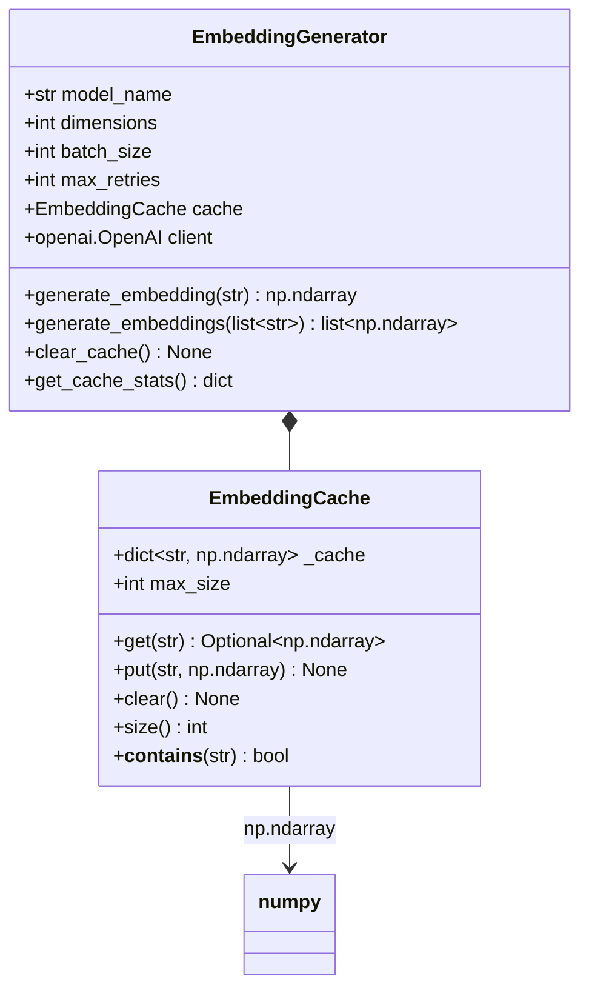

# Embedding Generation

This document describes the embedding generation system for the Knowledge Compiler.

## Overview

The embedding generation system provides efficient vector embeddings for text using OpenAI's API. It supports:

- Batch processing for multiple texts
- LRU caching to avoid redundant API calls
- Automatic retry with exponential backoff
- Numpy array integration for ML workflows
- Cache statistics and management



## Architecture

### EmbeddingGenerator

Main class for generating embeddings using OpenAI's API.

**Constructor Parameters:**

| Parameter | Type | Default | Description |
|-----------|------|---------|-------------|
| `model_name` | `str` | `"text-embedding-3-small"` | OpenAI embedding model |
| `dimensions` | `int` | `None` | Embedding dimensions (None for model default) |
| `batch_size` | `int` | `100` | Number of texts to process per batch |
| `max_retries` | `int` | `3` | Maximum retry attempts for API failures |
| `cache_max_size` | `int` | `1000` | Maximum size of embedding cache |

**Supported Models:**

- `text-embedding-3-small`: 1536 dimensions, fast and cost-effective
- `text-embedding-3-large`: 3072 dimensions, higher quality
- `text-embedding-ada-002`: 1536 dimensions, legacy model

**Example:**

```python
from src.ml.embeddings import EmbeddingGenerator

# Initialize with defaults
generator = EmbeddingGenerator()

# Or customize
generator = EmbeddingGenerator(
    model_name="text-embedding-3-large",
    dimensions=3072,
    batch_size=50,
    max_retries=5,
    cache_max_size=2000
)
```

### EmbeddingCache

LRU cache for storing embeddings to avoid redundant API calls.

**Constructor Parameters:**

| Parameter | Type | Default | Description |
|-----------|------|---------|-------------|
| `max_size` | `int` | `1000` | Maximum number of embeddings to cache |

**Methods:**

#### `get(key: str) -> Optional[np.ndarray]`

Get embedding from cache.

**Parameters:**
- `key`: Cache key (MD5 hash of text)

**Returns:** Cached embedding or None if not found

#### `put(key: str, embedding: np.ndarray) -> None`

Store embedding in cache.

**Parameters:**
- `key`: Cache key
- `embedding`: Embedding vector to cache

**Behavior:**
- Evicts oldest entries if cache is full
- Maintains LRU ordering

#### `clear() -> None`

Clear all cached embeddings.

#### `size() -> int`

Get current cache size.

**Returns:** Number of cached embeddings

#### `__contains__(key: str) -> bool`

Check if key exists in cache.

**Example:**

```python
from src.ml.embeddings import EmbeddingCache
import numpy as np

cache = EmbeddingCache(max_size=100)

# Add embeddings
cache.put("key1", np.random.rand(1536))
cache.put("key2", np.random.rand(1536))

# Check cache
print("key1" in cache)  # True
print(cache.size())  # 2

# Get embedding
embedding = cache.get("key1")

# Clear cache
cache.clear()
print(cache.size())  # 0
```

## Usage Examples

### Single Text Embedding

```python
from src.ml.embeddings import EmbeddingGenerator

generator = EmbeddingGenerator()

text = "Machine learning is a subset of artificial intelligence."

embedding = generator.generate_embedding(text)

print(f"Embedding shape: {embedding.shape}")  # (1536,)
print(f"Embedding dtype: {embedding.dtype}")  # float32
print(f"First 5 values: {embedding[:5]}")
```

### Batch Text Embeddings

```python
from src.ml.embeddings import EmbeddingGenerator

generator = EmbeddingGenerator(batch_size=10)

texts = [
    "Machine learning enables computers to learn from data.",
    "Deep learning uses neural networks with multiple layers.",
    "Natural language processing deals with text understanding.",
    # ... more texts
]

embeddings = generator.generate_embeddings(texts)

print(f"Generated {len(embeddings)} embeddings")
print(f"Each embedding has shape: {embeddings[0].shape}")  # (1536,)

# Access individual embeddings
for i, embedding in enumerate(embeddings):
    print(f"Text {i}: {embedding[:5]}")
```

### Using Caching

```python
from src.ml.embeddings import EmbeddingGenerator

generator = EmbeddingGenerator(cache_max_size=1000)

# First call - hits API
text = "This text will be cached."
embedding1 = generator.generate_embedding(text)

# Second call - uses cache (no API call)
embedding2 = generator.generate_embedding(text)

# Embeddings are identical
import numpy as np
print(np.array_equal(embedding1, embedding2))  # True

# Check cache stats
stats = generator.get_cache_stats()
print(f"Cache size: {stats['size']}/{stats['max_size']}")
```

### Custom Dimensions

```python
from src.ml.embeddings import EmbeddingGenerator

# text-embedding-3-small supports dimensions from 1 to 1536
generator = EmbeddingGenerator(
    model_name="text-embedding-3-small",
    dimensions=512  # Reduced dimensionality for faster processing
)

text = "Sample text for embedding."
embedding = generator.generate_embedding(text)

print(f"Embedding shape: {embedding.shape}")  # (512,)
```

### With Error Handling

```python
from src.ml.embeddings import EmbeddingGenerator

generator = EmbeddingGenerator(max_retries=3)

try:
    embedding = generator.generate_embedding("Some text")
    print("Success!")
except RuntimeError as e:
    print(f"Failed to generate embedding: {e}")
except ValueError as e:
    print(f"Configuration error: {e}")
```

## Integration with Data Models

### Adding Embeddings to Documents

```python
from src.ml.embeddings import EmbeddingGenerator
from src.core.document_model import EnhancedDocument, DocumentMetadata
from src.core.base_models import SourceType

generator = EmbeddingGenerator()

metadata = DocumentMetadata(title="Sample Document")
doc = EnhancedDocument(
    id="doc-001",
    source_type=SourceType.MARKDOWN,
    content="This is the document content.",
    metadata=metadata
)

# Generate and set embedding
doc.embeddings = generator.generate_embedding(doc.content)

# Save document
doc_dict = doc.to_dict()
print(f"Document has embedding: {doc.embeddings is not None}")
print(f"Embedding shape: {doc.embeddings.shape}")
```

### Adding Embeddings to Concepts

```python
from src.ml.embeddings import EmbeddingGenerator
from src.core.concept_model import EnhancedConcept, ConceptType

generator = EmbeddingGenerator()

concept = EnhancedConcept(
    id="concept-001",
    name="Machine Learning",
    type=ConceptType.THEORY,
    definition="A subset of AI that enables systems to learn from data."
)

# Generate embedding from definition
concept.embeddings = generator.generate_embedding(concept.definition)

print(f"Concept embedding shape: {concept.embeddings.shape}")
```

### Batch Processing Documents

```python
from src.ml.embeddings import EmbeddingGenerator

generator = EmbeddingGenerator(batch_size=50)

documents = [
    {"id": "doc-001", "content": "Content 1..."},
    {"id": "doc-002", "content": "Content 2..."},
    # ... more documents
]

# Extract texts
texts = [doc["content"] for doc in documents]

# Generate embeddings in batch
embeddings = generator.generate_embeddings(texts)

# Assign back to documents
for doc, embedding in zip(documents, embeddings):
    doc["embedding"] = embedding

print(f"Processed {len(documents)} documents")
```

## Cache Management

### Checking Cache Statistics

```python
from src.ml.embeddings import EmbeddingGenerator

generator = EmbeddingGenerator(cache_max_size=1000)

# Generate some embeddings
for i in range(10):
    generator.generate_embedding(f"Text {i}")

# Get cache stats
stats = generator.get_cache_stats()
print(f"Cache size: {stats['size']}")
print(f"Max size: {stats['max_size']}")
print(f"Utilization: {stats['size'] / stats['max_size'] * 100:.1f}%")
```

### Clearing Cache

```python
from src.ml.embeddings import EmbeddingGenerator

generator = EmbeddingGenerator()

# Generate embeddings (fills cache)
for i in range(100):
    generator.generate_embedding(f"Text {i}")

stats = generator.get_cache_stats()
print(f"Cache size before clear: {stats['size']}")

# Clear cache
generator.clear_cache()

stats = generator.get_cache_stats()
print(f"Cache size after clear: {stats['size']}")  # 0
```

### Custom Cache Configuration

```python
from src.ml.embeddings import EmbeddingGenerator

# Small cache for memory-constrained environments
generator = EmbeddingGenerator(cache_max_size=100)

# Large cache for production systems
generator = EmbeddingGenerator(cache_max_size=10000)

# Disable caching (set to 0)
generator = EmbeddingGenerator(cache_max_size=0)
```

## Performance Optimization

### Batch Size Tuning

```python
from src.ml.embeddings import EmbeddingGenerator
import time

# Small batch size (more API calls, slower)
generator = EmbeddingGenerator(batch_size=10)
start = time.time()
embeddings = generator.generate_embeddings(texts * 100)
small_batch_time = time.time() - start

# Large batch size (fewer API calls, faster)
generator = EmbeddingGenerator(batch_size=100)
start = time.time()
embeddings = generator.generate_embeddings(texts * 100)
large_batch_time = time.time() - start

print(f"Small batch: {small_batch_time:.2f}s")
print(f"Large batch: {large_batch_time:.2f}s")
```

### Dimensionality Reduction

```python
from src.ml.embeddings import EmbeddingGenerator

# Full dimensionality (higher quality, slower)
generator_full = EmbeddingGenerator(
    model_name="text-embedding-3-small",
    dimensions=None  # 1536
)

# Reduced dimensionality (lower quality, faster)
generator_reduced = EmbeddingGenerator(
    model_name="text-embedding-3-small",
    dimensions=512
)

text = "Sample text for comparison."
embedding_full = generator_full.generate_embedding(text)
embedding_reduced = generator_reduced.generate_embedding(text)

print(f"Full: {embedding_full.shape}")
print(f"Reduced: {embedding_reduced.shape}")
```

### Model Selection

```python
from src.ml.embeddings import EmbeddingGenerator

# Fast and cost-effective (good for most use cases)
generator_small = EmbeddingGenerator(
    model_name="text-embedding-3-small"  # 1536 dimensions
)

# Higher quality (slower and more expensive)
generator_large = EmbeddingGenerator(
    model_name="text-embedding-3-large"  # 3072 dimensions
)

# Legacy model (not recommended)
generator_ada = EmbeddingGenerator(
    model_name="text-embedding-ada-002"  # 1536 dimensions
)
```

## Error Handling

### Retry Logic

```python
from src.ml.embeddings import EmbeddingGenerator

# Configure retries
generator = EmbeddingGenerator(
    max_retries=5  # Will retry 5 times on failure
)

# Automatic retry with exponential backoff
try:
    embedding = generator.generate_embedding("Some text")
except RuntimeError as e:
    print(f"Failed after all retries: {e}")
```

### Common Errors

```python
from src.ml.embeddings import EmbeddingGenerator

# Missing API key
try:
    generator = EmbeddingGenerator()
except ValueError as e:
    print(f"Configuration error: {e}")
    # Set OPENAI_API_KEY environment variable

# Invalid text
generator = EmbeddingGenerator()
try:
    embedding = generator.generate_embedding("")  # Empty string
    # This may fail or return low-quality embedding
except Exception as e:
    print(f"Error with empty text: {e}")
```

## Best Practices

1. **Always use caching**: Enable caching to avoid redundant API calls
2. **Choose appropriate batch size**: Balance between API calls and memory usage
3. **Select right model**: Use `text-embedding-3-small` for most cases
4. **Handle errors gracefully**: Always wrap API calls in try-except
5. **Monitor cache utilization**: Check cache stats to optimize size
6. **Use dimensionality reduction**: Reduce dimensions if full quality isn't needed
7. **Batch when possible**: Use `generate_embeddings()` for multiple texts
8. **Preprocess text**: Clean and normalize text before embedding

## Integration Examples

### With State Manager

```python
from src.ml.embeddings import EmbeddingGenerator
from src.core.state_manager import StateManager

generator = EmbeddingGenerator()
state_manager = StateManager()

# Check if document already has embeddings
doc_id = "doc-001"
doc_state = state_manager.get_document_state(doc_id)

if doc_state and doc_state.get("has_embeddings"):
    print("Document already has embeddings")
else:
    # Generate embeddings
    text = "Document content..."
    embedding = generator.generate_embedding(text)

    # Update state
    state_manager.set_document_state(doc_id, {
        "status": "processed",
        "has_embeddings": True
    })
    state_manager.save()
```

### With Configuration

```python
from src.core.config import get_config
from src.ml.embeddings import EmbeddingGenerator

config = get_config()

# Check if embedding caching is enabled
if config.processing.cache_embeddings:
    generator = EmbeddingGenerator(
        cache_max_size=1000
    )
else:
    generator = EmbeddingGenerator(
        cache_max_size=0  # Disable cache
    )

# Use generator
embedding = generator.generate_embedding("Sample text")
```

### Pipeline Integration

```python
from src.ml.embeddings import EmbeddingGenerator

class ProcessingPipeline:
    def __init__(self):
        self.embedding_generator = EmbeddingGenerator(
            batch_size=50,
            cache_max_size=2000
        )

    def process_documents(self, documents):
        """Process documents with embeddings."""
        # Extract texts
        texts = [doc.content for doc in documents]

        # Generate embeddings
        embeddings = self.embedding_generator.generate_embeddings(texts)

        # Assign embeddings
        for doc, embedding in zip(documents, embeddings):
            doc.embeddings = embedding

        return documents

# Use pipeline
pipeline = ProcessingPipeline()
processed_docs = pipeline.process_documents(documents)
```

## Performance Benchmarks

Approximate performance on typical hardware:

```
Model: text-embedding-3-small
Dimensions: 1536
Batch Size: 100

Single text: ~100ms
Batch of 10: ~500ms
Batch of 100: ~2000ms
Cache hit: <1ms
```

```
Model: text-embedding-3-large
Dimensions: 3072
Batch Size: 100

Single text: ~200ms
Batch of 10: ~1000ms
Batch of 100: ~4000ms
Cache hit: <1ms
```

**Note:** Actual performance depends on network conditions and API load.

## Troubleshooting

### Out of Memory

```python
# Problem: Large batch sizes consume too much memory
generator = EmbeddingGenerator(batch_size=1000)

# Solution: Reduce batch size
generator = EmbeddingGenerator(batch_size=50)
```

### Slow Processing

```python
# Problem: Processing is slow due to cache misses
generator = EmbeddingGenerator(cache_max_size=0)

# Solution: Enable caching with appropriate size
generator = EmbeddingGenerator(cache_max_size=1000)
```

### API Rate Limits

```python
# Problem: Hitting OpenAI rate limits
generator = EmbeddingGenerator(batch_size=1000)

# Solution: Reduce batch size and add delays
import time
generator = EmbeddingGenerator(batch_size=50)

for i in range(0, len(texts), 50):
    batch = texts[i:i+50]
    embeddings = generator.generate_embeddings(batch)
    time.sleep(1)  # Rate limiting delay
```
