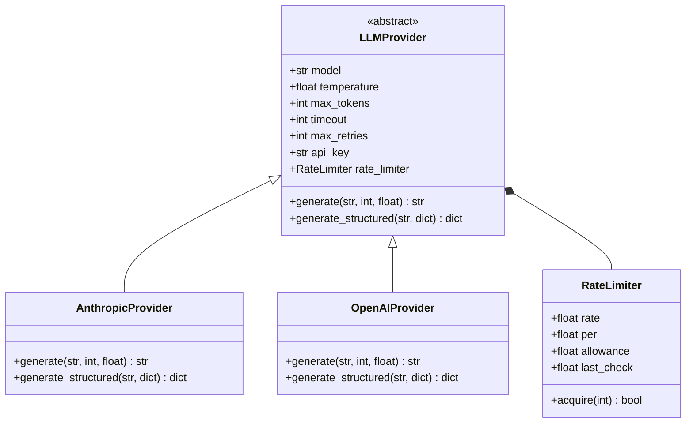
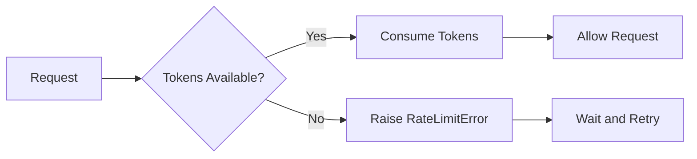

# LLM Provider Integration

This document describes the LLM provider integration system for the Knowledge Compiler.

## Overview

The LLM provider integration provides a unified interface for interacting with different Large Language Model providers. It supports:

- Multiple LLM providers (Anthropic Claude, OpenAI GPT)
- Automatic retry with exponential backoff
- Rate limiting to prevent API quota exhaustion
- Structured output generation with schema validation
- Easy provider switching without code changes



## Architecture

### LLMProvider (Abstract Base Class)

The `LLMProvider` abstract base class defines the interface that all LLM providers must implement.

**Constructor Parameters:**

| Parameter | Type | Default | Description |
|-----------|------|---------|-------------|
| `model` | `str` | Required | Model name/identifier |
| `temperature` | `float` | `0.3` | Sampling temperature (0.0 to 1.0) |
| `max_tokens` | `int` | `4096` | Maximum tokens in response |
| `timeout` | `int` | `60` | Request timeout in seconds |
| `max_retries` | `int` | `3` | Maximum retry attempts |
| `api_key` | `str` | `None` | API key (overrides env var) |
| `api_key_env` | `str` | `None` | Environment variable name for API key |
| `rate_limit` | `float` | `None` | Max requests per period (None = no limit) |
| `rate_limit_period` | `float` | `60.0` | Time period for rate limit in seconds |

**Abstract Methods:**

- `generate(prompt, max_tokens=None, temperature=None) -> str`
- `generate_structured(prompt, schema) -> Dict[str, Any]`

### AnthropicProvider

Implementation for Anthropic's Claude API.

**Default Model:** `claude-sonnet-4-6`

**Default API Key Environment:** `ANTHROPIC_API_KEY`

**Features:**
- Full Claude API support
- Structured output with JSON schema validation
- Automatic retry and rate limiting
- Timeout handling

**Example:**

```python
from src.integrations.llm_providers import AnthropicProvider

# Initialize with defaults
provider = AnthropicProvider()

# Or customize
provider = AnthropicProvider(
    model="claude-opus-4-5",
    temperature=0.5,
    max_tokens=8192,
    rate_limit=50,  # 50 requests per minute
    rate_limit_period=60.0
)

# Generate text
response = provider.generate("Explain machine learning in simple terms.")
print(response)

# Generate structured output
schema = {
    "type": "object",
    "properties": {
        "summary": {"type": "string"},
        "key_points": {"type": "array", "items": {"type": "string"}}
    },
    "required": ["summary", "key_points"]
}

structured_response = provider.generate_structured(
    "Summarize this document about AI.",
    schema=schema
)
print(structured_response)
```

### OpenAIProvider

Implementation for OpenAI's GPT API.

**Default Model:** `gpt-4-turbo`

**Default API Key Environment:** `OPENAI_API_KEY`

**Features:**
- Full GPT API support
- Structured output with JSON schema validation
- Automatic retry and rate limiting
- Timeout handling

**Example:**

```python
from src.integrations.llm_providers import OpenAIProvider

# Initialize with defaults
provider = OpenAIProvider()

# Or customize
provider = OpenAIProvider(
    model="gpt-4-turbo",
    temperature=0.3,
    max_tokens=4096,
    rate_limit=100,  # 100 requests per minute
    rate_limit_period=60.0
)

# Generate text
response = provider.generate("Explain quantum computing.")
print(response)

# Generate structured output
schema = {
    "type": "object",
    "properties": {
        "definition": {"type": "string"},
        "applications": {"type": "array", "items": {"type": "string"}}
    },
    "required": ["definition"]
}

structured_response = provider.generate_structured(
    "Describe quantum computing applications.",
    schema=schema
)
```

## Rate Limiting

### RateLimiter Class

Implements a token bucket algorithm for rate limiting.

**Constructor Parameters:**

| Parameter | Type | Default | Description |
|-----------|------|---------|-------------|
| `rate` | `float` | Required | Maximum number of requests allowed |
| `per` | `float` | `60.0` | Time period in seconds |

**Methods:**

#### `acquire(tokens: int = 1) -> bool`

Acquire tokens from the bucket.

**Parameters:**
- `tokens`: Number of tokens to acquire (default: 1)

**Returns:** `True` if tokens were acquired

**Raises:**
- `RateLimitError`: If rate limit would be exceeded

**Example:**

```python
from src.integrations.llm_providers import RateLimiter, RateLimitError

# Allow 10 requests per minute
limiter = RateLimiter(rate=10, per=60.0)

try:
    for i in range(15):
        limiter.acquire()
        print(f"Request {i+1} allowed")
except RateLimitError as e:
    print(f"Rate limit exceeded: {e}")
```

**How It Works:**



The token bucket algorithm:
1. Tokens are added at a fixed rate over time
2. Requests consume tokens from the bucket
3. If insufficient tokens, request is blocked
4. Bucket has maximum capacity (tokens don't accumulate indefinitely)

## Retry Logic

### Exponential Backoff

Automatic retry with exponential backoff for transient failures.

**Decorator:**

```python
@retry_with_exponential_backoff(
    max_retries=3,
    base_delay=1.0,
    max_delay=60.0,
    exponential_base=2
)
```

**Parameters:**

| Parameter | Type | Default | Description |
|-----------|------|---------|-------------|
| `max_retries` | `int` | `3` | Maximum retry attempts |
| `base_delay` | `float` | `1.0` | Initial delay in seconds |
| `max_delay` | `float` | `60.0` | Maximum delay in seconds |
| `exponential_base` | `float` | `2` | Base for exponential backoff |

**Retryable Errors:**

- Rate limit errors (HTTP 429)
- Timeout errors
- Connection errors
- Network errors

**Non-Retryable Errors:**

- Authentication errors (HTTP 401)
- Permission errors (HTTP 403)
- Client errors (4xx except 429)

**Example:**

```python
from src.integrations.llm_providers import retry_with_exponential_backoff

@retry_with_exponential_backoff(max_retries=3, base_delay=1.0)
def unreliable_function():
    # This will be retried on failure
    pass
```

## Structured Output

### Schema Validation

Generate structured data matching a JSON schema.

**Schema Format:**

```python
schema = {
    "type": "object",
    "properties": {
        "field_name": {
            "type": "string",
            "description": "Field description"
        },
        "numeric_field": {
            "type": "number",
            "minimum": 0.0,
            "maximum": 1.0
        },
        "array_field": {
            "type": "array",
            "items": {"type": "string"}
        }
    },
    "required": ["field_name"],
    "additionalProperties": False
}
```

**Example Usage:**

```python
from src.integrations.llm_providers import AnthropicProvider

provider = AnthropicProvider()

schema = {
    "type": "object",
    "properties": {
        "concepts": {
            "type": "array",
            "items": {
                "type": "object",
                "properties": {
                    "name": {"type": "string"},
                    "definition": {"type": "string"},
                    "confidence": {"type": "number"}
                },
                "required": ["name", "definition", "confidence"]
            }
        }
    },
    "required": ["concepts"]
}

prompt = """
Extract key concepts from this text:
'Machine learning is a subset of artificial intelligence that enables systems to learn from data.'
"""

result = provider.generate_structured(prompt, schema=schema)
print(result)
# Output:
# {
#     "concepts": [
#         {
#             "name": "Machine Learning",
#             "definition": "A subset of AI that enables systems to learn from data",
#             "confidence": 0.95
#         },
#         {
#             "name": "Artificial Intelligence",
#             "definition": "Intelligence demonstrated by machines",
#             "confidence": 0.90
#         }
#     ]
# }
```

## Factory Function

### `get_llm_provider()`

Factory function to create LLM provider instances.

**Signature:**

```python
def get_llm_provider(
    provider: str = "anthropic",
    api_key_env: Optional[str] = None,
    **kwargs
) -> LLMProvider
```

**Parameters:**

| Parameter | Type | Default | Description |
|-----------|------|---------|-------------|
| `provider` | `str` | `"anthropic"` | Provider name ('anthropic' or 'openai') |
| `api_key_env` | `str` | `None` | Environment variable for API key |
| `**kwargs` | `dict` | `{}` | Additional arguments for provider |

**Returns:** LLM provider instance

**Raises:** `ValueError` if provider name is unknown

**Example:**

```python
from src.integrations.llm_providers import get_llm_provider

# Get Anthropic provider
anthropic = get_llm_provider(
    provider="anthropic",
    model="claude-sonnet-4-6",
    temperature=0.3
)

# Get OpenAI provider
openai = get_llm_provider(
    provider="openai",
    model="gpt-4-turbo",
    temperature=0.5,
    rate_limit=100
)
```

## Usage Examples

### Basic Text Generation

```python
from src.integrations.llm_providers import AnthropicProvider

provider = AnthropicProvider(
    model="claude-sonnet-4-6",
    temperature=0.3,
    max_tokens=4096
)

response = provider.generate(
    "Explain the concept of embeddings in natural language processing."
)

print(response)
```

### Concept Extraction

```python
from src.integrations.llm_providers import AnthropicProvider

provider = AnthropicProvider()

schema = {
    "type": "object",
    "properties": {
        "concepts": {
            "type": "array",
            "items": {
                "type": "object",
                "properties": {
                    "name": {"type": "string"},
                    "type": {"type": "string", "enum": ["term", "indicator", "strategy", "theory"]},
                    "definition": {"type": "string"},
                    "confidence": {"type": "number", "minimum": 0.0, "maximum": 1.0}
                },
                "required": ["name", "type", "definition", "confidence"]
            }
        }
    },
    "required": ["concepts"]
}

text = """
Machine learning algorithms use statistical techniques to enable computer systems
to 'learn' from data, without being explicitly programmed.
"""

result = provider.generate_structured(
    f"Extract concepts from: {text}",
    schema=schema
)

for concept in result["concepts"]:
    print(f"{concept['name']}: {concept['definition']}")
```

### Relation Extraction

```python
schema = {
    "type": "object",
    "properties": {
        "relations": {
            "type": "array",
            "items": {
                "type": "object",
                "properties": {
                    "source": {"type": "string"},
                    "target": {"type": "string"},
                    "relation_type": {
                        "type": "string",
                        "enum": ["causes", "caused_by", "contains", "contained_in", "related_to"]
                    },
                    "strength": {"type": "number", "minimum": 0.0, "maximum": 1.0},
                    "confidence": {"type": "number", "minimum": 0.0, "maximum": 1.0}
                },
                "required": ["source", "target", "relation_type", "strength", "confidence"]
            }
        }
    },
    "required": ["relations"]
}

text = """
Machine learning is a subset of artificial intelligence. Deep learning is a specialized
branch of machine learning that uses neural networks with multiple layers.
"""

result = provider.generate_structured(
    f"Extract relationships from: {text}",
    schema=schema
)

for relation in result["relations"]:
    print(f"{relation['source']} --{relation['relation_type']}--> {relation['target']}")
```

### With Rate Limiting

```python
from src.integrations.llm_providers import AnthropicProvider

# Anthropic's free tier: 5 requests per minute
provider = AnthropicProvider(
    model="claude-sonnet-4-6",
    rate_limit=5,
    rate_limit_period=60.0
)

# Make multiple requests - rate limiter will automatically pace them
for i in range(10):
    try:
        response = provider.generate(f"Explain concept {i}")
        print(f"Request {i+1} completed")
    except Exception as e:
        print(f"Request {i+1} failed: {e}")
```

### Error Handling

```python
from src.integrations.llm_providers import AnthropicProvider, RateLimitError

provider = AnthropicProvider(
    rate_limit=10,
    rate_limit_period=60.0
)

try:
    response = provider.generate("Generate some text")
except RateLimitError as e:
    print(f"Rate limit exceeded: {e}")
    # Wait and retry
except Exception as e:
    print(f"Other error: {e}")
```

## Best Practices

1. **Always set rate limits**: Configure rate limits to match your API tier
2. **Use structured output**: Prefer `generate_structured()` for data extraction
3. **Handle errors gracefully**: Always wrap API calls in try-except blocks
4. **Cache results**: Cache LLM responses to avoid redundant API calls
5. **Monitor usage**: Track API usage to avoid quota exhaustion
6. **Use appropriate temperature**:
   - Lower (0.0-0.3) for factual extraction
   - Medium (0.3-0.7) for balanced responses
   - Higher (0.7-1.0) for creative content
7. **Set reasonable timeouts**: Don't let requests hang indefinitely

## Performance Considerations

### Rate Limiting

```python
# Good: Explicit rate limiting
provider = AnthropicProvider(
    rate_limit=50,
    rate_limit_period=60.0
)

# Bad: No rate limiting (may exceed API quota)
provider = AnthropicProvider()
```

### Retry Configuration

```python
# Good: Reasonable retry settings
provider = AnthropicProvider(
    max_retries=3,
    timeout=60
)

# Bad: Too many retries (wastes time on persistent failures)
provider = AnthropicProvider(
    max_retries=10,
    timeout=120
)
```

### Batch Processing

```python
# Good: Process multiple items in a loop with rate limiting
provider = AnthropicProvider(rate_limit=10, rate_limit_period=60.0)
for item in items:
    result = provider.generate(prompt)
    # Rate limiter automatically paces requests

# Bad: Parallel requests without rate limiting
from concurrent.futures import ThreadPoolExecutor
provider = AnthropicProvider()
with ThreadPoolExecutor(max_workers=10) as executor:
    futures = [executor.submit(provider.generate, p) for p in prompts]
    # This will likely hit rate limits
```

## Troubleshooting

### Import Errors

```
ImportError: anthropic package is required. Install with: pip install anthropic>=0.25.0
```

**Solution:**
```bash
pip install anthropic>=0.25.0
# or
pip install openai>=1.10.0
```

### Rate Limit Errors

```
RateLimitError: Rate limit exceeded: 1 tokens requested, but only 0.50 available.
```

**Solution:** Wait and retry, or increase your rate limit configuration

### Authentication Errors

```
anthropic.AuthenticationError: Invalid API key
```

**Solution:** Check that your `ANTHROPIC_API_KEY` or `OPENAI_API_KEY` environment variable is set correctly

### Timeout Errors

```
Timeout error: Request timed out after 60 seconds
```

**Solution:** Increase the `timeout` parameter or reduce prompt complexity

## Integration with Configuration

```python
from src.core.config import get_config
from src.integrations.llm_providers import get_llm_provider

# Load configuration
config = get_config()

# Create provider from config
provider = get_llm_provider(
    provider=config.llm.provider,
    model=config.llm.model,
    temperature=config.llm.temperature,
    max_tokens=config.llm.max_tokens,
    timeout=config.llm.timeout,
    max_retries=config.llm.max_retries,
    rate_limit=50,
    rate_limit_period=60.0
)

# Use provider
response = provider.generate("Hello, world!")
```
