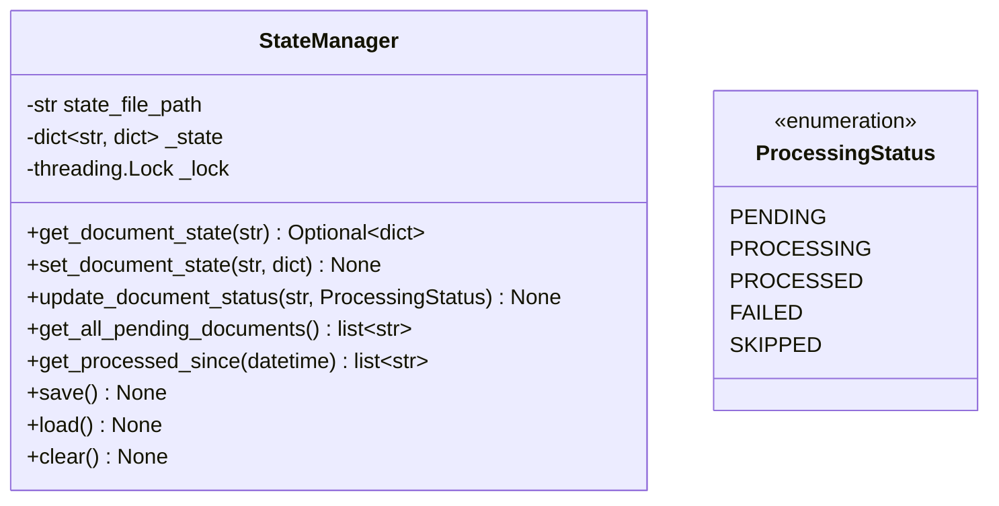

# State Management

This document describes the state management system for tracking document processing status.

## Overview

The `StateManager` provides thread-safe tracking and persistence of document processing state. It enables:

- Incremental processing (skip already processed documents)
- State persistence across runs
- Thread-safe operations
- Query operations for filtering documents
- Recovery from interruptions



## Architecture

### StateManager

Manager class for tracking and persisting document processing state.

**Constructor Parameters:**

| Parameter | Type | Default | Description |
|-----------|------|---------|-------------|
| `state_file_path` | `str` | `"./cache/state.json"` | Path to the state file |

**Thread Safety:**

All public methods are thread-safe and use internal locking to prevent race conditions.

**State File Format:**

```json
{
  "doc-001": {
    "status": "processed",
    "last_updated": "2026-04-05T10:30:00",
    "metadata": {
      "file_size": 1024,
      "checksum": "abc123"
    }
  },
  "doc-002": {
    "status": "pending",
    "last_updated": "2026-04-05T10:31:00"
  }
}
```

## Methods

### `get_document_state(document_id: str) -> Optional[Dict[str, Any]]`

Get state for a document.

**Parameters:**
- `document_id`: Unique identifier for the document

**Returns:** Document state dict or None if not found

**Example:**

```python
from src.core.state_manager import StateManager

state_manager = StateManager()

# Get state for a document
doc_state = state_manager.get_document_state("doc-001")

if doc_state:
    print(f"Status: {doc_state['status']}")
    print(f"Last updated: {doc_state['last_updated']}")
else:
    print("Document not found in state")
```

### `set_document_state(document_id: str, state: Dict[str, Any]) -> None`

Set state for a document.

**Parameters:**
- `document_id`: Unique identifier for the document
- `state`: State dictionary to set

**Behavior:**
- Automatically adds `last_updated` timestamp if not present
- Thread-safe operation

**Example:**

```python
from src.core.state_manager import StateManager
from src.core.base_models import ProcessingStatus

state_manager = StateManager()

# Set document state
state_manager.set_document_state("doc-001", {
    "status": ProcessingStatus.PROCESSED,
    "metadata": {
        "file_size": 1024,
        "processing_time": 2.5
    }
})

# Don't forget to save
state_manager.save()
```

### `update_document_status(document_id: str, status: ProcessingStatus) -> None`

Update document status.

**Parameters:**
- `document_id`: Unique identifier for the document
- `status`: New processing status

**Behavior:**
- Creates new state if document doesn't exist
- Preserves existing metadata
- Automatically updates timestamp
- Thread-safe operation

**Example:**

```python
from src.core.state_manager import StateManager
from src.core.base_models import ProcessingStatus

state_manager = StateManager()

# Update status to processing
state_manager.update_document_status("doc-001", ProcessingStatus.PROCESSING)

# Process document...

# Update status to processed
state_manager.update_document_status("doc-001", ProcessingStatus.PROCESSED)

# Save state
state_manager.save()
```

### `get_all_pending_documents() -> List[str]`

Get all documents with PENDING status.

**Returns:** List of document IDs with PENDING status

**Example:**

```python
from src.core.state_manager import StateManager

state_manager = StateManager()

# Get all pending documents
pending_docs = state_manager.get_all_pending_documents()

print(f"Found {len(pending_docs)} pending documents")
for doc_id in pending_docs:
    print(f"  - {doc_id}")
```

### `get_processed_since(since: datetime) -> List[str]`

Get documents processed since a given timestamp.

**Parameters:**
- `since`: Timestamp to filter by

**Returns:** List of document IDs processed after the timestamp

**Example:**

```python
from src.core.state_manager import StateManager
from datetime import datetime, timedelta

state_manager = StateManager()

# Get documents processed in the last 24 hours
yesterday = datetime.now() - timedelta(days=1)
recently_processed = state_manager.get_processed_since(yesterday)

print(f"Processed {len(recently_processed)} documents in the last 24 hours")
```

### `save() -> None`

Persist state to disk.

**Raises:**
- `OSError`: If unable to write to state file
- `IOError`: If unable to write to state file

**Example:**

```python
from src.core.state_manager import StateManager

state_manager = StateManager()

# Make changes
state_manager.update_document_status("doc-001", ProcessingStatus.PROCESSED)

# Save to disk
state_manager.save()
```

### `load() -> None`

Load state from disk.

**Behavior:**
- If file doesn't exist, initializes empty state
- If file is corrupted, initializes empty state
- Thread-safe operation

**Example:**

```python
from src.core.state_manager import StateManager

state_manager = StateManager()

# Reload state from disk
state_manager.load()
```

### `clear() -> None`

Clear all state and remove state file.

**Behavior:**
- Clears all in-memory state
- Removes state file from disk
- Thread-safe operation

**Example:**

```python
from src.core.state_manager import StateManager

state_manager = StateManager()

# Clear all state (use with caution!)
state_manager.clear()
```

## Usage Examples

### Basic State Tracking

```python
from src.core.state_manager import StateManager
from src.core.base_models import ProcessingStatus

# Initialize state manager
state_manager = StateManager()

# Process a document
doc_id = "doc-001"

# Mark as processing
state_manager.update_document_status(doc_id, ProcessingStatus.PROCESSING)

try:
    # Process document...
    print(f"Processing {doc_id}...")

    # Mark as processed
    state_manager.update_document_status(doc_id, ProcessingStatus.PROCESSED)

except Exception as e:
    # Mark as failed
    state_manager.update_document_status(doc_id, ProcessingStatus.FAILED)
    print(f"Failed to process {doc_id}: {e}")

finally:
    # Always save state
    state_manager.save()
```

### Incremental Processing

```python
from src.core.state_manager import StateManager
from src.core.base_models import ProcessingStatus

state_manager = StateManager()

# Get list of documents to process
all_documents = ["doc-001", "doc-002", "doc-003", "doc-004"]

# Only process pending documents
pending_docs = state_manager.get_all_pending_documents()

print(f"Total documents: {len(all_documents)}")
print(f"Already processed: {len(all_documents) - len(pending_docs)}")
print(f"Pending: {len(pending_docs)}")

# Process only pending documents
for doc_id in pending_docs:
    print(f"Processing {doc_id}...")
    state_manager.update_document_status(doc_id, ProcessingStatus.PROCESSING)
    state_manager.save()

    try:
        # Process document...
        pass

        state_manager.update_document_status(doc_id, ProcessingStatus.PROCESSED)
    except Exception as e:
        state_manager.update_document_status(doc_id, ProcessingStatus.FAILED)

    state_manager.save()
```

### Custom Metadata

```python
from src.core.state_manager import StateManager
from src.core.base_models import ProcessingStatus

state_manager = StateManager()

# Set state with custom metadata
state_manager.set_document_state("doc-001", {
    "status": ProcessingStatus.PROCESSED,
    "metadata": {
        "file_size": 1024,
        "checksum": "abc123",
        "processing_time": 2.5,
        "concepts_extracted": 5,
        "relations_extracted": 3
    }
})

state_manager.save()

# Retrieve metadata
doc_state = state_manager.get_document_state("doc-001")
print(f"Processing time: {doc_state['metadata']['processing_time']}s")
print(f"Concepts extracted: {doc_state['metadata']['concepts_extracted']}")
```

### Filtering by Time

```python
from src.core.state_manager import StateManager
from datetime import datetime, timedelta

state_manager = StateManager()

# Get documents processed today
today = datetime.now().replace(hour=0, minute=0, second=0, microsecond=0)
processed_today = state_manager.get_processed_since(today)

print(f"Processed {len(processed_today)} documents today")

# Get documents processed this week
week_ago = datetime.now() - timedelta(days=7)
processed_this_week = state_manager.get_processed_since(week_ago)

print(f"Processed {len(processed_this_week)} documents this week")
```

### Thread-Safe Operations

```python
from src.core.state_manager import StateManager
from src.core.base_models import ProcessingStatus
import threading

state_manager = StateManager()

def process_document(doc_id):
    """Process a document in a thread."""
    # This is thread-safe
    state_manager.update_document_status(doc_id, ProcessingStatus.PROCESSING)

    # Process document...
    print(f"Thread {threading.current_thread().name} processing {doc_id}")

    state_manager.update_document_status(doc_id, ProcessingStatus.PROCESSED)
    state_manager.save()

# Process multiple documents in parallel
threads = []
for doc_id in ["doc-001", "doc-002", "doc-003"]:
    thread = threading.Thread(target=process_document, args=(doc_id,))
    threads.append(thread)
    thread.start()

# Wait for all threads to complete
for thread in threads:
    thread.join()

print("All documents processed")
```

### Recovery from Interruption

```python
from src.core.state_manager import StateManager
from src.core.base_models import ProcessingStatus

# Initialize state manager (loads existing state)
state_manager = StateManager()

# Check for interrupted processing
interrupted_docs = []
all_states = state_manager._state  # Access internal state

for doc_id, doc_state in all_states.items():
    if doc_state.get("status") == ProcessingStatus.PROCESSING:
        interrupted_docs.append(doc_id)

print(f"Found {len(interrupted_docs)} interrupted documents")

# Reset interrupted documents to pending
for doc_id in interrupted_docs:
    print(f"Resetting {doc_id} to pending")
    state_manager.update_document_status(doc_id, ProcessingStatus.PENDING)

state_manager.save()

# Resume processing
for doc_id in interrupted_docs:
    # Reprocess document...
    pass
```

## Integration Examples

### With Document Processing

```python
from src.core.state_manager import StateManager
from src.core.base_models import ProcessingStatus
from src.core.document_model import EnhancedDocument

class DocumentProcessor:
    def __init__(self):
        self.state_manager = StateManager()

    def process_document(self, document: EnhancedDocument):
        """Process a document with state tracking."""
        doc_id = document.id

        # Skip if already processed
        doc_state = self.state_manager.get_document_state(doc_id)
        if doc_state and doc_state.get("status") == ProcessingStatus.PROCESSED:
            print(f"Skipping {doc_id} (already processed)")
            return

        # Mark as processing
        self.state_manager.update_document_status(doc_id, ProcessingStatus.PROCESSING)
        self.state_manager.save()

        try:
            # Process document
            print(f"Processing {doc_id}...")
            # ... processing logic ...

            # Mark as processed
            self.state_manager.set_document_state(doc_id, {
                "status": ProcessingStatus.PROCESSED,
                "metadata": {
                    "quality_score": document.quality_score,
                    "concepts_count": len(document.concepts)
                }
            })

        except Exception as e:
            print(f"Error processing {doc_id}: {e}")
            self.state_manager.update_document_status(doc_id, ProcessingStatus.FAILED)

        finally:
            self.state_manager.save()

# Use processor
processor = DocumentProcessor()
processor.process_document(document)
```

### With Configuration

```python
from src.core.config import get_config
from src.core.state_manager import StateManager

config = get_config()

# Use configured cache directory
state_file = f"{config.storage.cache_dir}/state.json"
state_manager = StateManager(state_file)

# Use state manager
state_manager.update_document_status("doc-001", ProcessingStatus.PROCESSED)
state_manager.save()
```

### Batch Processing with Progress

```python
from src.core.state_manager import StateManager
from src.core.base_models import ProcessingStatus

state_manager = StateManager()

def process_batch(document_ids):
    """Process a batch of documents with progress tracking."""
    total = len(document_ids)
    processed = 0
    failed = 0
    skipped = 0

    for doc_id in document_ids:
        # Check if already processed
        doc_state = state_manager.get_document_state(doc_id)
        if doc_state and doc_state.get("status") == ProcessingStatus.PROCESSED:
            skipped += 1
            continue

        # Process document
        state_manager.update_document_status(doc_id, ProcessingStatus.PROCESSING)

        try:
            # ... processing logic ...
            state_manager.update_document_status(doc_id, ProcessingStatus.PROCESSED)
            processed += 1

        except Exception as e:
            state_manager.update_document_status(doc_id, ProcessingStatus.FAILED)
            failed += 1

        state_manager.save()

        # Print progress
        print(f"Progress: {processed + failed + skipped}/{total} "
              f"(Processed: {processed}, Failed: {failed}, Skipped: {skipped})")

    print(f"\nBatch complete:")
    print(f"  Processed: {processed}")
    print(f"  Failed: {failed}")
    print(f"  Skipped: {skipped}")

# Use batch processor
document_ids = ["doc-001", "doc-002", "doc-003", "doc-004"]
process_batch(document_ids)
```

## Best Practices

1. **Always save after changes**: Call `save()` after modifying state
2. **Handle exceptions**: Use try-except blocks when processing documents
3. **Check state before processing**: Avoid reprocessing completed documents
4. **Use meaningful metadata**: Store useful information with document state
5. **Clean up failed documents**: Periodically reset or retry failed documents
6. **Use incremental processing**: Leverage state to skip completed work
7. **Thread safety**: StateManager is thread-safe, but save operations should be coordinated
8. **Backup state**: Periodically backup state file for recovery

## State File Location

The default state file location is:

```
./cache/state.json
```

You can customize this by passing a different path:

```python
from src.core.state_manager import StateManager

# Custom location
state_manager = StateManager(state_file_path="/data/state.json")
```

The directory will be created automatically if it doesn't exist.

## Performance Considerations

### Save Frequency

```python
# Bad: Saving after every document (slow)
for doc_id in document_ids:
    process_document(doc_id)
    state_manager.save()  # Too many disk writes

# Good: Save in batches
batch_size = 100
for i in range(0, len(document_ids), batch_size):
    batch = document_ids[i:i+batch_size]
    for doc_id in batch:
        process_document(doc_id)
    state_manager.save()  # Fewer disk writes
```

### Load on Startup

```python
# Good: Load state once at startup
state_manager = StateManager()  # Automatically loads state

# Bad: Reloading state frequently
state_manager = StateManager()
for doc_id in document_ids:
    state_manager.load()  # Unnecessary reloading
    process_document(doc_id)
```

### Memory Usage

```python
# State is kept in memory for fast access
# For very large datasets, consider:
# 1. Sharding state across multiple files
# 2. Using a database instead of JSON
# 3. Only keeping recent state in memory
```

## Troubleshooting

### Corrupted State File

```python
# If state file is corrupted, StateManager will initialize empty state
state_manager = StateManager()

# Check if state was loaded
if not state_manager._state:
    print("Starting with empty state (file was corrupted or missing)")
```

### Concurrent Access

```python
# StateManager uses internal locking for thread safety
# But concurrent writes from different processes can cause issues
# For multi-process scenarios, use file locking or a database
```

### State File Growing Too Large

```python
# Periodically clean up old state entries
from datetime import datetime, timedelta

state_manager = StateManager()
cutoff = datetime.now() - timedelta(days=30)

# Remove old processed documents
to_remove = []
for doc_id, doc_state in state_manager._state.items():
    if doc_state.get("status") == ProcessingStatus.PROCESSED:
        last_updated = datetime.fromisoformat(doc_state["last_updated"])
        if last_updated < cutoff:
            to_remove.append(doc_id)

for doc_id in to_remove:
    del state_manager._state[doc_id]

state_manager.save()
print(f"Removed {len(to_remove)} old state entries")
```
